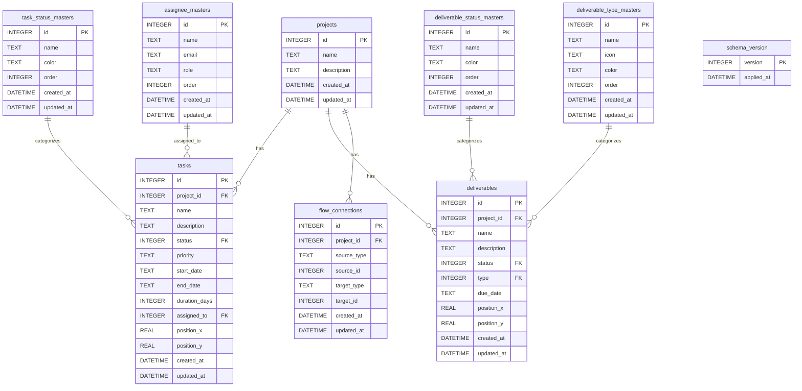

# データベーススキーマ定義

AIR-Projectで使用するSQLiteデータベースのスキーマ定義ドキュメント。

## 概要

- **データベースエンジン**: SQLite 3
- **保存場所**: `%APPDATA%\com.airproject.dev\data.db` (Windows)
- **実装**: Tauri SQL Plugin (@tauri-apps/plugin-sql)
- **バージョン管理**: `schema_version` テーブルで管理

## テーブル一覧

### 1. schema_version（スキーマバージョン管理）

データベーススキーマのバージョンを管理するテーブル。

```sql
CREATE TABLE schema_version (
  version INTEGER PRIMARY KEY,
  applied_at DATETIME DEFAULT CURRENT_TIMESTAMP
);
```

| カラム名 | 型 | 制約 | 説明 |
|---------|-----|------|------|
| version | INTEGER | PRIMARY KEY | スキーマバージョン番号 |
| applied_at | DATETIME | DEFAULT CURRENT_TIMESTAMP | 適用日時 |

---

### 2. projects（プロジェクト）

プロジェクトの基本情報を格納するテーブル。

```sql
CREATE TABLE projects (
  id INTEGER PRIMARY KEY AUTOINCREMENT,
  name TEXT NOT NULL,
  description TEXT,
  created_at DATETIME DEFAULT CURRENT_TIMESTAMP,
  updated_at DATETIME DEFAULT CURRENT_TIMESTAMP
);
```

| カラム名 | 型 | 制約 | 説明 |
|---------|-----|------|------|
| id | INTEGER | PRIMARY KEY AUTOINCREMENT | プロジェクトID |
| name | TEXT | NOT NULL | プロジェクト名 |
| description | TEXT | - | プロジェクト説明 |
| created_at | DATETIME | DEFAULT CURRENT_TIMESTAMP | 作成日時 |
| updated_at | DATETIME | DEFAULT CURRENT_TIMESTAMP | 更新日時 |

---

### 3. task_status_masters（タスクステータスマスタ）

タスクのステータス種別を管理するマスタテーブル。

```sql
CREATE TABLE task_status_masters (
  id INTEGER PRIMARY KEY AUTOINCREMENT,
  name TEXT NOT NULL,
  color TEXT NOT NULL,
  "order" INTEGER NOT NULL DEFAULT 0,
  created_at DATETIME DEFAULT CURRENT_TIMESTAMP,
  updated_at DATETIME DEFAULT CURRENT_TIMESTAMP
);
```

| カラム名 | 型 | 制約 | 説明 |
|---------|-----|------|------|
| id | INTEGER | PRIMARY KEY AUTOINCREMENT | ステータスID |
| name | TEXT | NOT NULL | ステータス名 |
| color | TEXT | NOT NULL | 表示色（HEX形式: #RRGGBB） |
| "order" | INTEGER | NOT NULL DEFAULT 0 | 表示順序 |
| created_at | DATETIME | DEFAULT CURRENT_TIMESTAMP | 作成日時 |
| updated_at | DATETIME | DEFAULT CURRENT_TIMESTAMP | 更新日時 |

**デフォルトデータ**:
- (1) 未着手 - #9ca3af
- (2) 進行中 - #3b82f6
- (3) 完了 - #10b981
- (4) ブロック - #ef4444

---

### 4. deliverable_status_masters（成果物ステータスマスタ）

成果物のステータス種別を管理するマスタテーブル。

```sql
CREATE TABLE deliverable_status_masters (
  id INTEGER PRIMARY KEY AUTOINCREMENT,
  name TEXT NOT NULL,
  color TEXT NOT NULL,
  "order" INTEGER NOT NULL DEFAULT 0,
  created_at DATETIME DEFAULT CURRENT_TIMESTAMP,
  updated_at DATETIME DEFAULT CURRENT_TIMESTAMP
);
```

| カラム名 | 型 | 制約 | 説明 |
|---------|-----|------|------|
| id | INTEGER | PRIMARY KEY AUTOINCREMENT | ステータスID |
| name | TEXT | NOT NULL | ステータス名 |
| color | TEXT | NOT NULL | 表示色（HEX形式: #RRGGBB） |
| "order" | INTEGER | NOT NULL DEFAULT 0 | 表示順序 |
| created_at | DATETIME | DEFAULT CURRENT_TIMESTAMP | 作成日時 |
| updated_at | DATETIME | DEFAULT CURRENT_TIMESTAMP | 更新日時 |

**デフォルトデータ**:
- (1) 未作成 - #9ca3af
- (2) 作成中 - #3b82f6
- (3) レビュー中 - #f59e0b
- (4) 完成 - #10b981

---

### 5. assignee_masters（担当者マスタ）

タスク・成果物の担当者を管理するマスタテーブル。

```sql
CREATE TABLE assignee_masters (
  id INTEGER PRIMARY KEY AUTOINCREMENT,
  name TEXT NOT NULL,
  email TEXT,
  role TEXT,
  "order" INTEGER NOT NULL DEFAULT 0,
  created_at DATETIME DEFAULT CURRENT_TIMESTAMP,
  updated_at DATETIME DEFAULT CURRENT_TIMESTAMP
);
```

| カラム名 | 型 | 制約 | 説明 |
|---------|-----|------|------|
| id | INTEGER | PRIMARY KEY AUTOINCREMENT | 担当者ID |
| name | TEXT | NOT NULL | 担当者名 |
| email | TEXT | - | メールアドレス |
| role | TEXT | - | 役割・職種 |
| "order" | INTEGER | NOT NULL DEFAULT 0 | 表示順序 |
| created_at | DATETIME | DEFAULT CURRENT_TIMESTAMP | 作成日時 |
| updated_at | DATETIME | DEFAULT CURRENT_TIMESTAMP | 更新日時 |

**デフォルトデータ**:
- (1) 未割当 - （メール・役割なし）
- (2) 山田太郎 - yamada@example.com (エンジニア)
- (3) 佐藤花子 - sato@example.com (デザイナー)

---

### 6. deliverable_type_masters（成果物種類マスタ）

成果物の種類を管理するマスタテーブル。

```sql
CREATE TABLE deliverable_type_masters (
  id INTEGER PRIMARY KEY AUTOINCREMENT,
  name TEXT NOT NULL,
  icon TEXT NOT NULL,
  color TEXT NOT NULL,
  "order" INTEGER NOT NULL DEFAULT 0,
  created_at DATETIME DEFAULT CURRENT_TIMESTAMP,
  updated_at DATETIME DEFAULT CURRENT_TIMESTAMP
);
```

| カラム名 | 型 | 制約 | 説明 |
|---------|-----|------|------|
| id | INTEGER | PRIMARY KEY AUTOINCREMENT | 種類ID |
| name | TEXT | NOT NULL | 種類名 |
| icon | TEXT | NOT NULL | アイコン名（React Icons） |
| color | TEXT | NOT NULL | 表示色（HEX形式: #RRGGBB） |
| "order" | INTEGER | NOT NULL DEFAULT 0 | 表示順序 |
| created_at | DATETIME | DEFAULT CURRENT_TIMESTAMP | 作成日時 |
| updated_at | DATETIME | DEFAULT CURRENT_TIMESTAMP | 更新日時 |

**デフォルトデータ**:
- (1) 設計書 - MdDescription - #3b82f6
- (2) コード - MdCode - #10b981
- (3) テストケース - MdFactCheck - #f59e0b
- (4) ドキュメント - MdArticle - #8b5cf6

---

### 7. tasks（タスク）

プロジェクト内のタスク情報を格納するテーブル。

```sql
CREATE TABLE tasks (
  id INTEGER PRIMARY KEY AUTOINCREMENT,
  project_id INTEGER NOT NULL,
  name TEXT NOT NULL,
  description TEXT,
  status INTEGER NOT NULL,
  priority TEXT CHECK(priority IN ('low', 'medium', 'high', 'critical')) DEFAULT 'medium',
  start_date TEXT,
  end_date TEXT,
  duration_days INTEGER,
  assigned_to INTEGER,
  position_x REAL NOT NULL DEFAULT 0,
  position_y REAL NOT NULL DEFAULT 0,
  created_at DATETIME DEFAULT CURRENT_TIMESTAMP,
  updated_at DATETIME DEFAULT CURRENT_TIMESTAMP,
  FOREIGN KEY (project_id) REFERENCES projects(id) ON DELETE CASCADE,
  FOREIGN KEY (status) REFERENCES task_status_masters(id),
  FOREIGN KEY (assigned_to) REFERENCES assignee_masters(id)
);
```

| カラム名 | 型 | 制約 | 説明 |
|---------|-----|------|------|
| id | INTEGER | PRIMARY KEY AUTOINCREMENT | タスクID |
| project_id | INTEGER | NOT NULL, FK → projects.id | プロジェクトID |
| name | TEXT | NOT NULL | タスク名 |
| description | TEXT | - | タスク説明 |
| status | INTEGER | NOT NULL, FK → task_status_masters.id | ステータスID |
| priority | TEXT | CHECK IN ('low', 'medium', 'high', 'critical'), DEFAULT 'medium' | 優先度 |
| start_date | TEXT | - | 開始日（ISO 8601形式） |
| end_date | TEXT | - | 終了日（ISO 8601形式） |
| duration_days | INTEGER | - | 所要日数 |
| assigned_to | INTEGER | FK → assignee_masters.id | 担当者ID |
| position_x | REAL | NOT NULL DEFAULT 0 | フロー図X座標 |
| position_y | REAL | NOT NULL DEFAULT 0 | フロー図Y座標 |
| created_at | DATETIME | DEFAULT CURRENT_TIMESTAMP | 作成日時 |
| updated_at | DATETIME | DEFAULT CURRENT_TIMESTAMP | 更新日時 |

**インデックス**:
```sql
CREATE INDEX idx_tasks_project_id ON tasks(project_id);
CREATE INDEX idx_tasks_status ON tasks(status);
CREATE INDEX idx_tasks_assigned_to ON tasks(assigned_to);
```

---

### 8. deliverables（成果物）

プロジェクト内の成果物情報を格納するテーブル。

```sql
CREATE TABLE deliverables (
  id INTEGER PRIMARY KEY AUTOINCREMENT,
  project_id INTEGER NOT NULL,
  name TEXT NOT NULL,
  description TEXT,
  status INTEGER NOT NULL,
  type INTEGER NOT NULL,
  due_date TEXT,
  position_x REAL NOT NULL DEFAULT 0,
  position_y REAL NOT NULL DEFAULT 0,
  created_at DATETIME DEFAULT CURRENT_TIMESTAMP,
  updated_at DATETIME DEFAULT CURRENT_TIMESTAMP,
  FOREIGN KEY (project_id) REFERENCES projects(id) ON DELETE CASCADE,
  FOREIGN KEY (status) REFERENCES deliverable_status_masters(id),
  FOREIGN KEY (type) REFERENCES deliverable_type_masters(id)
);
```

| カラム名 | 型 | 制約 | 説明 |
|---------|-----|------|------|
| id | INTEGER | PRIMARY KEY AUTOINCREMENT | 成果物ID |
| project_id | INTEGER | NOT NULL, FK → projects.id | プロジェクトID |
| name | TEXT | NOT NULL | 成果物名 |
| description | TEXT | - | 成果物説明 |
| status | INTEGER | NOT NULL, FK → deliverable_status_masters.id | ステータスID |
| type | INTEGER | NOT NULL, FK → deliverable_type_masters.id | 種類ID |
| due_date | TEXT | - | 期限日（ISO 8601形式） |
| position_x | REAL | NOT NULL DEFAULT 0 | フロー図X座標 |
| position_y | REAL | NOT NULL DEFAULT 0 | フロー図Y座標 |
| created_at | DATETIME | DEFAULT CURRENT_TIMESTAMP | 作成日時 |
| updated_at | DATETIME | DEFAULT CURRENT_TIMESTAMP | 更新日時 |

**インデックス**:
```sql
CREATE INDEX idx_deliverables_project_id ON deliverables(project_id);
CREATE INDEX idx_deliverables_status ON deliverables(status);
CREATE INDEX idx_deliverables_type ON deliverables(type);
```

---

### 9. flow_connections（フロー接続）

タスク・成果物間の依存関係（接続）を管理するテーブル。

```sql
CREATE TABLE flow_connections (
  id INTEGER PRIMARY KEY AUTOINCREMENT,
  project_id INTEGER NOT NULL,
  source_type TEXT CHECK(source_type IN ('task', 'deliverable')) NOT NULL,
  source_id INTEGER NOT NULL,
  target_type TEXT CHECK(target_type IN ('task', 'deliverable')) NOT NULL,
  target_id INTEGER NOT NULL,
  created_at DATETIME DEFAULT CURRENT_TIMESTAMP,
  updated_at DATETIME DEFAULT CURRENT_TIMESTAMP,
  FOREIGN KEY (project_id) REFERENCES projects(id) ON DELETE CASCADE
);
```

| カラム名 | 型 | 制約 | 説明 |
|---------|-----|------|------|
| id | INTEGER | PRIMARY KEY AUTOINCREMENT | 接続ID |
| project_id | INTEGER | NOT NULL, FK → projects.id | プロジェクトID |
| source_type | TEXT | CHECK IN ('task', 'deliverable'), NOT NULL | 接続元の種類 |
| source_id | INTEGER | NOT NULL | 接続元ID |
| target_type | TEXT | CHECK IN ('task', 'deliverable'), NOT NULL | 接続先の種類 |
| target_id | INTEGER | NOT NULL | 接続先ID |
| created_at | DATETIME | DEFAULT CURRENT_TIMESTAMP | 作成日時 |
| updated_at | DATETIME | DEFAULT CURRENT_TIMESTAMP | 更新日時 |

**インデックス**:
```sql
CREATE INDEX idx_flow_connections_project_id ON flow_connections(project_id);
```

---

## ER図



## データ整合性ルール

### 外部キー制約

1. **プロジェクト削除時の CASCADE**
   - プロジェクトを削除すると、関連するtasks、deliverables、flow_connectionsも自動削除

2. **マスタデータ参照整合性**
   - タスク・成果物のステータスは対応するマスタテーブルのIDを参照
   - 使用中のマスタデータは削除不可（アプリケーションレベルで制御）

### CHECK制約

1. **tasks.priority**
   - 許可値: 'low', 'medium', 'high', 'critical'

2. **flow_connections.source_type / target_type**
   - 許可値: 'task', 'deliverable'

## マイグレーション管理

スキーマバージョンは `schema_version` テーブルで管理。

**現在のバージョン**: 1

### バージョン履歴

- **Version 1** (2025-01-15): 初期スキーマ
  - 全テーブル作成
  - インデックス作成
  - デフォルトデータ挿入

## 実装ファイル

- **スキーマ定義**: `src/services/sqliteDatabase.ts`
- **TypeScript型定義**: `src/types/index.ts`
- **アダプター**: `src/services/databaseAdapter.ts`

## 備考

- 日付フィールドはISO 8601形式（YYYY-MM-DD）で保存
- 日時フィールドはSQLiteのDATETIME型（YYYY-MM-DD HH:MM:SS）
- カラー値はHEX形式（#RRGGBB）で保存
- アイコン名はReact Iconsのコンポーネント名を保存
